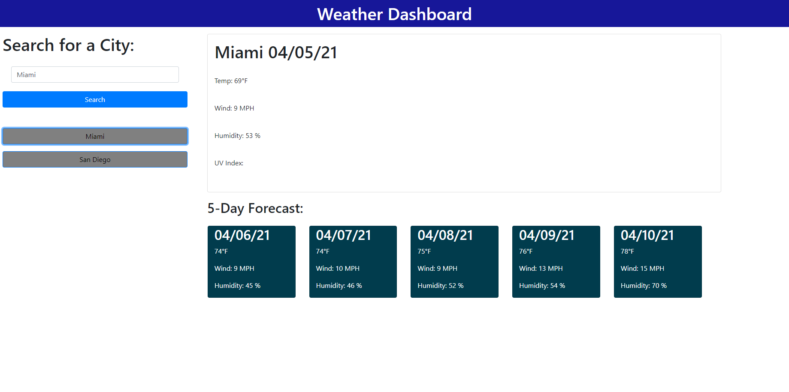

# weather_dashboard

## 4/5/21

This application allows a user to input a city and will then display the current weather. A 5-day forecast is also displayed at the bottom of the page. Local storage keeps track of each city that has been searched for and then displays them on the page the next time the user visits.

## Link to Application

https://keddie024.github.io/weather_dashboard/

## Image of Application

